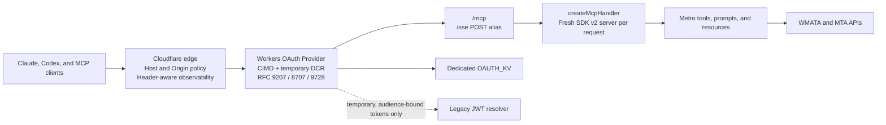

# MCP 2026-07-28 Upgrade — Design Spec

**Date:** 2026-08-13
**Status:** Approved scope; awaiting written-spec review
**Target release:** 5.0.0
**Target PR:** one feature PR (`feat/mcp-2026-upgrade`)

## 1. Goal

Upgrade Metro MCP from the sessionful MCP `2025-06-18` architecture to MCP `2026-07-28` in one feature PR. The release replaces the deprecated `McpAgent` transport session with a stateless SDK v2 server, adopts the current Cloudflare OAuth Provider, preserves ordinary 2025 client compatibility, migrates station disambiguation to Multi Round-Trip Requests (MRTR), adds protocol-aware security and verification, and removes protocol-only Durable Object infrastructure.

The transit product remains the same: thirteen read-only tools, three resources, three prompts, DC Metro support, and NYC Subway support. This is an infrastructure and protocol upgrade, not a transit-feature redesign.

## 2. Authoritative references

- [The next generation of MCP](https://blog.cloudflare.com/mcp-v2/)
- [Bringing MCP 2026-07-28 to Claude](https://claude.com/blog/bringing-mcp-2026-07-28-to-claude)
- [The 2026-07-28 Specification](https://blog.modelcontextprotocol.io/posts/2026-07-28/)
- [MCP 2026-07-28 authorization](https://modelcontextprotocol.io/specification/2026-07-28/basic/authorization)
- [MCP 2026-07-28 Streamable HTTP](https://modelcontextprotocol.io/specification/2026-07-28/basic/transports/streamable-http)
- [Cloudflare SDK v2 migration guide](https://developers.cloudflare.com/agents/model-context-protocol/guides/migrate-to-mcp-sdk-v2/)
- [Cloudflare MCP handler API](https://developers.cloudflare.com/agents/model-context-protocol/apis/handler-api/)
- [Cloudflare Workers OAuth Provider](https://github.com/cloudflare/workers-oauth-provider)

If upstream documentation and this spec disagree during implementation, the published MCP `2026-07-28` specification controls protocol behavior. Cloudflare's current package documentation controls Worker-specific integration details.

## 3. Locked decisions

| Decision | Choice |
|---|---|
| Delivery | One feature PR for protocol, auth, compatibility, tests, docs, and infrastructure cleanup |
| Target protocol | MCP `2026-07-28` |
| Compatibility | Modern stateless protocol plus SDK v2's 2025 stateless compatibility |
| Stateful legacy lane | Not included |
| Legacy `/sse` URL | Remains a POST alias to the stateless Streamable HTTP handler |
| Legacy HTTP+SSE transport | Removed; `GET` and `DELETE` return `405` |
| Server API | `createMcpHandler` from `agents/mcp/server` |
| MCP SDK | `@modelcontextprotocol/server@2.0.0` |
| OAuth | Current `@cloudflare/workers-oauth-provider`, with GitHub retained as the upstream identity provider |
| Client registration | Pre-registration and CIMD preferred; DCR retained as a time-boxed fallback |
| Application scope | `transit:read` |
| Elicitation | MRTR `input_required`; deterministic retry guidance for legacy clients |
| Protocol Durable Object | Removed |
| MCP Apps | Explicitly deferred to the next PR |
| Tasks | Not implemented because no operation is long-running or asynchronous |

## 4. Current-state findings

The current architecture is sessionful even though the transit application is not:

- `MetroMcpAgent` extends Cloudflare's deprecated `McpAgent`.
- Each MCP session is stored in the `MCP_SESSION` Durable Object.
- The Durable Object contains transport state and replay data, not user transit data.
- `/mcp` and `/sse` delegate to `MetroMcpAgent.serve({ transport: "auto" })`.
- One tool uses pushed elicitation to disambiguate station names.
- One tool emits request-scoped progress notifications.
- Resources are read-only and do not publish update notifications.
- There is no persisted tool workflow, saved commute, alert subscription, or other cross-request application state.

The custom OAuth implementation is behind the new protocol requirements:

- It supports hand-written DCR but not Client ID Metadata Documents (CIMD).
- It does not emit or advertise RFC 9207 authorization response issuer identifiers.
- It accepts legacy tokens without an audience.
- It accepts bearer tokens from URL query parameters.
- It advertises refresh-token support but does not implement the refresh grant.
- It advertises client authentication methods that the token endpoint does not consistently enforce.
- It auto-approves the MCP grant after GitHub authentication instead of presenting explicit MCP client consent.

The test suite exercises helpers under Node.js but does not exercise the assembled Worker, SDK transport, OAuth discovery, Workerd behavior, or real MCP protocol negotiation.

## 5. Target architecture



### 5.1 Request lifecycle

1. An unauthenticated MCP request reaches the OAuth Provider wrapper.
2. The wrapper returns an RFC 6750 challenge containing RFC 9728 protected-resource metadata.
3. The client discovers the authorization server and obtains a client ID through pre-registration, CIMD, or the temporary DCR fallback.
4. The user authenticates with GitHub and approves the `transit:read` grant.
5. The OAuth Provider issues a resource-bound token and rotating refresh token.
6. For an authenticated request, the provider validates the token and supplies standard `AuthInfo` and application props.
7. `createMcpHandler` constructs a fresh SDK v2 `McpServer` for that request.
8. The server invokes the existing WMATA/MTA client and returns a JSON or request-scoped SSE response.

No protocol session or protocol-specific Durable Object is created.

### 5.2 Code boundaries

The current 1,000-line `mcp-agent.ts` is split because the SDK migration already requires touching every registration and replacing `this.env`/`this.props` access.

| Unit | Responsibility |
|---|---|
| `src/mcp/server.ts` | Create a fresh SDK v2 server and call all registration functions in deterministic order |
| `src/mcp/context.ts` | Define request-era and authenticated request dependencies shared by registrations |
| `src/mcp/tools/stations.ts` | Station tools and MRTR station selection |
| `src/mcp/tools/incidents.ts` | Incident and elevator tools |
| `src/mcp/tools/buses.ts` | DC bus tools |
| `src/mcp/tools/trains.ts` | NYC train tools |
| `src/mcp/tools/routes.ts` | Route tools |
| `src/mcp/resources.ts` | Three `transit://` resource templates and cache hints |
| `src/mcp/prompts.ts` | Three prompt registrations and cache hints |
| `src/mcp/http-handler.ts` | Compose `createMcpHandler`, route aliases, Host/Origin policy, and safe error reporting |
| `src/oauth/provider.ts` | Configure the Workers OAuth Provider and protected route map |
| `src/oauth/github-handler.ts` | GitHub login, callback, consent, and `completeAuthorization()` |
| `src/oauth/legacy-token.ts` | Temporary validation of existing audience-bound custom JWTs |
| `src/public-handler.ts` | `/info`, landing assets, and application-owned OAuth UI routes |

Registration functions consume a single explicit dependency object:

```ts
export interface MetroMcpContext {
  env: Env;
  era: "modern" | "legacy";
  authInfo: AuthInfo;
  props: {
    userId: string;
    userLogin: string;
  };
}

export function createMetroMcpServer(context: MetroMcpContext): McpServer;
```

No server instance is shared between protocol requests. Pure schemas and formatting helpers may remain module-scoped.

## 6. Protocol behavior

### 6.1 Modern requests

The `/mcp` endpoint supports MCP `2026-07-28` without an initialization handshake. Protocol version, client identity, and capabilities arrive on every request. The SDK owns validation of request metadata and the `Mcp-Protocol-Version`, `Mcp-Method`, and `Mcp-Name` header mirrors.

The handler uses:

- `legacy: "stateless"` for ordinary 2025 compatibility.
- `responseMode: "auto"` so progress notifications can use request-scoped SSE.
- `allowedHostnames: ["metro-mcp.anuragd.me"]` in production.
- Explicit local development allowances for `localhost` and `127.0.0.1`.
- Browser Origin access for the production Metro MCP origin and local development origins. Origin-less desktop and server clients remain valid.

### 6.2 `/sse` compatibility alias

`POST /sse` invokes the same stateless handler as `POST /mcp`. It does not create a session and does not implement the deprecated HTTP+SSE transport.

`GET /sse`, `DELETE /sse`, and session message subpaths return `405 Method Not Allowed` with an `Allow: POST, OPTIONS` header. Documentation directs every new client to `/mcp` and describes `/sse` only as a URL compatibility alias.

### 6.3 Station disambiguation through MRTR

`get_station_predictions` becomes a re-entrant operation:

1. Resolve an unambiguous station ID directly when possible.
2. If multiple stations match a modern request and no accepted input response is present, return `input_required` with a form containing the candidate IDs and names.
3. Seal the normalized city, original query, candidate IDs, authenticated user ID, tool name, and expiration in integrity-protected `requestState`.
4. On retry, validate the state, user binding, expiration, and chosen candidate before fetching predictions.
5. A declined or cancelled input produces a non-retryable, user-readable tool result.

For a 2025 stateless request, pushed elicitation is unavailable. The tool returns an error result listing candidates and instructing the client to call the same tool again with an exact station ID. It never silently picks the first ambiguous match.

### 6.4 Progress

`get_all_stations` retains progress notifications when the client supplies a progress token and accepts a streaming response. Tests require both progress notifications to precede the final result. The endpoint does not force JSON response mode because JSON mode discards intermediate notifications.

### 6.5 Catalog caching

Registration order is fixed and tested. Static discovery results use MCP cache hints:

- `tools/list`: global scope, 24-hour TTL.
- `prompts/list`: global scope, 24-hour TTL.
- Static `resources/list`: global scope, 24-hour TTL.
- Live `resources/read`, arrivals, predictions, and incident results: no broad cache hint.

No user-specific result is globally cacheable.

## 7. Authorization and authentication

### 7.1 Provider ownership

`@cloudflare/workers-oauth-provider` owns:

- Authorization server metadata.
- Protected-resource metadata.
- Token and refresh grants.
- Token revocation.
- PKCE validation.
- Resource/audience binding.
- RFC 9207 issuer emission.
- CIMD and DCR client validation.
- Token and client storage in `OAUTH_KV`.

GitHub remains an identity provider only. The application handler authenticates the GitHub user, renders consent, and calls `completeAuthorization()` with `transit:read` and `{ userId, userLogin }` props.

### 7.2 Registration priority

The server enables all three standardized registration paths in this order:

1. Pre-registered clients when Metro MCP has an existing relationship with a client.
2. Client ID Metadata Documents for general modern clients.
3. DCR at `/register` for compatibility.

CIMD requires `global_fetch_strictly_public` in Wrangler configuration. DCR remains enabled in 5.0.0 but documentation announces a `2027-06-30` sunset. Removing DCR is not part of this PR.

### 7.3 OAuth scopes and lifetimes

- MCP resource scope: `transit:read`.
- GitHub upstream scope: the minimum identity scope needed to obtain the user's stable ID and display login.
- Access tokens: maximum 60-minute lifetime.
- Refresh tokens: maximum 30-day lifetime, rotated on use.
- Authorization codes: single-use and short-lived under provider defaults.
- Dynamically registered clients: provider TTL of 90 days.

The consent page identifies the requesting client, the canonical Metro MCP resource, and the `transit:read` permission. Unknown clients and invalid redirect URIs are rendered locally and never redirected.

### 7.4 Resource and token rules

The canonical resource is `https://metro-mcp.anuragd.me/mcp`. Authorization and token requests bind grants to this value. Tokens for a different origin or incompatible path are rejected.

Bearer tokens are accepted only through the `Authorization` header. Query parameters named `access_token` or `token` are rejected and never advertised.

### 7.5 Legacy JWT bridge

The new provider may call `resolveExternalToken` for a token it did not issue. The temporary resolver:

- Verifies the existing HMAC signature and expiration.
- Requires an `aud` exactly matching the canonical Metro MCP resource after permitted URI normalization.
- Requires the Authorization header.
- Maps the legacy user ID/login into provider-compatible props and `transit:read` scope.
- Rejects every legacy token without an audience.
- Rejects every legacy token after `2026-11-30T00:00:00Z`, even when its embedded expiration is later.

The release stops issuing custom JWTs. `JWT_SECRET` remains configured only until the bridge deadline and is removed after the deadline in a later maintenance change. Existing DCR client records are not imported because the old storage and client-authentication semantics do not match the provider. Clients can re-register through CIMD or the retained DCR endpoint when reauthorization is required.

## 8. Cloudflare configuration

The PR changes Wrangler configuration as follows:

- Add a dedicated `OAUTH_KV` namespace binding for the provider.
- Add `global_fetch_strictly_public` alongside the required runtime compatibility flags.
- Remove the `MCP_SESSION` Durable Object binding.
- Add a new migration tag deleting `MetroMcpAgent` after its routes are removed.
- Remove the `MetroMcpAgent` class export.
- Remove the unused `RATE_LIMIT_KV` binding and the misleading no-op rate-limit implementation.
- Retain the existing `OAUTH_CLIENTS` namespace itself outside the Worker binding during the rollback window; no production data is deleted by the PR.
- Preserve custom-domain, asset, observability, and source-map settings.

Cloudflare edge rate-limiting policy is configured separately from application code. Rules may distinguish requests by `Mcp-Method` and `Mcp-Name`, but they must also key enforcement to authenticated client/user context or source identity and must not trust header names as authorization proof.

## 9. Observability and error handling

Each protected request emits structured telemetry containing:

- Protocol era and version.
- `Mcp-Method` and `Mcp-Name` after SDK validation.
- Route alias used.
- Authenticated OAuth client ID.
- Tool duration, upstream provider, status class, and request correlation ID.

Telemetry never contains access tokens, authorization codes, refresh tokens, raw OAuth props, GitHub tokens, full request bodies, or MRTR form contents.

OAuth protocol errors use the status codes and response shapes produced by the provider. Tool failures continue through the shared transit-error normalizer. Invalid Host or Origin values return `403`; missing or invalid credentials return `401` with protected-resource discovery; insufficient scope returns `403` with scope guidance.

## 10. Dependency and lockfile policy

Protocol-critical packages are exact-pinned to the mutually compatible versions verified immediately before implementation. The initial target set is:

- `agents@0.20.1`
- `@modelcontextprotocol/server@2.0.0`
- `@cloudflare/workers-oauth-provider@0.10.3`
- A Zod 4 version satisfying the exact Agents/SDK peer constraints

`@modelcontextprotocol/sdk` is removed because no stateful legacy lane remains. `bun.lock` is the only dependency lockfile. CI installs with `bun install --frozen-lockfile`.

## 11. Verification strategy

### 11.1 Unit tests

- Preserve all transit-client and formatting tests.
- Test deterministic tool, prompt, and resource registrations.
- Test MRTR state creation, accepted selection, decline, cancellation, expiration, tampering, invalid candidate, and cross-user replay.
- Test legacy JWT signature, expiration, audience, header-only transport, and absolute cutoff.
- Test safe telemetry field selection.

### 11.2 Workerd integration tests

Configure `@cloudflare/vitest-pool-workers` and exercise the assembled Worker:

- Unauthenticated `POST /mcp` returns an RFC 9728 challenge.
- MCP `2026-07-28` works without `initialize`.
- `server/discover` returns the expected capabilities.
- A 2025 stateless client can list and call ordinary tools.
- `Mcp-Protocol-Version`, `Mcp-Method`, and `Mcp-Name` are handled correctly.
- Header/body metadata mismatches are rejected.
- `/sse` POST aliases `/mcp`; GET and DELETE return `405`.
- Host and Origin rules accept declared hosts and reject malformed or undeclared values.
- Progress notifications arrive before the final response.
- Request cancellation stops downstream work where the transit client supports abort signals.

### 11.3 OAuth tests

- Authorization and protected-resource discovery metadata.
- Valid CIMD registration.
- Invalid CIMD URL, redirect URI, oversized response, timeout, and private-network target.
- DCR fallback and client expiration.
- PKCE S256 and redirect matching.
- RFC 9207 `iss` response behavior.
- RFC 8707 resource binding on authorization, code exchange, and refresh.
- Access-token expiration, rotating refresh, retry behavior, and revocation.
- Query-string token rejection.
- Legacy token bridge acceptance and rejection rules.
- Consent grant and denied-consent paths.

### 11.4 Conformance and real clients

- Run the current MCP SDK v2 server conformance suite.
- Run the OAuth Provider conformance suite supported by the installed release.
- Connect through the production-shaped custom-domain URL with Claude and Codex.
- Verify OAuth discovery, consent, tools/list, at least one DC tool, one NYC tool, one prompt, one resource, MRTR selection, and progress.
- Verify a client configured with `/sse` and automatic/Streamable HTTP transport still connects.
- Verify a client forced to legacy SSE receives the documented failure.

## 12. Release and rollback

The PR is implemented in independently reviewable commits but merges as one feature:

1. Add SDK v2 contract tests and dependency pins.
2. Introduce the stateless server factory and migrate tools/resources/prompts.
3. Add MRTR and progress compatibility.
4. Integrate the OAuth Provider, CIMD, consent, and legacy-token bridge.
5. Switch routes and remove `McpAgent`/Durable Object infrastructure.
6. Add Workerd, conformance, and real-client verification support.
7. Update docs, server metadata, and version to 5.0.0.

Before production deployment, the complete PR runs on a preview Worker with a separate preview OAuth KV namespace and callback URL. Production deployment uses a versioned Worker release. The prior Worker version, original OAuth KV namespace, GitHub OAuth configuration, and `JWT_SECRET` remain available through the stabilization window.

Rollback restores the prior Worker version. Protocol-session Durable Object data is considered disposable transport state; no transit application data is deleted. Recreating the old DO class after a rollback may create fresh sessions, which is acceptable because clients already must reconnect across a protocol downgrade.

Production acceptance requires:

- Every existing tool, resource, and prompt passes its behavior fixture.
- MCP 2026 and 2025 stateless compatibility suites pass.
- OAuth discovery and security suites pass.
- Claude and Codex complete real authenticated calls.
- No credential appears in logs or URLs.
- No request creates or addresses `MCP_SESSION`.
- The landing page and `/info` remain available.

## 13. Documentation changes

The PR updates:

- Protocol badge and server version to MCP `2026-07-28` / Metro MCP `5.0.0`.
- Architecture documentation from sessionful `McpAgent` to stateless SDK v2.
- `/sse` documentation to describe the alias and legacy-SSE removal.
- OAuth documentation for CIMD-first registration, DCR fallback, explicit consent, refresh tokens, resource binding, and query-token rejection.
- Cloudflare deployment instructions for `OAUTH_KV` and `global_fetch_strictly_public`.
- Security documentation for RFC 9207, RFC 8707, RFC 9728, host/origin enforcement, legacy-token cutoff, and logging rules.
- Client smoke-test instructions for Claude and Codex.

## 14. Out of scope

- MCP Apps or embedded interactive UI. This is the next feature PR.
- MCP Tasks.
- Enterprise-Managed Authorization.
- Saved commutes, alert subscriptions, user preferences, or other new application state.
- Incident push subscriptions or cross-isolate notification fan-out.
- New transit agencies, tools, resources, or prompts.
- A permanent stateful compatibility lane.
- Deleting the old OAuth KV namespace or rotating `JWT_SECRET` before the rollback and bridge windows expire.

## 15. Success definition

Metro MCP 5.0.0 is successful when current Claude and Codex clients can authenticate and use the complete transit surface over MCP `2026-07-28`, ordinary 2025 stateless clients continue to work, ambiguous station selection uses MRTR on capable clients, OAuth meets the new authorization requirements, legacy HTTP+SSE and protocol sessions are gone, and the deployed Worker no longer depends on a protocol-specific Durable Object.
