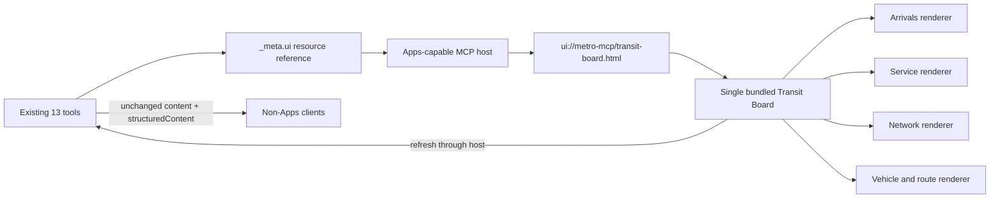

# Metro MCP Apps Design

**Date:** 2026-08-19
**Status:** Approved
**Target branch:** `feat/mcp-apps`
**Base:** `origin/main` at merge commit `26d23eb`

## Summary

Metro MCP will add one adaptive, read-only MCP App named **Transit Board**. All thirteen existing transit tools will reference the same `ui://` resource and retain their current text and structured results. MCP Apps-capable hosts will render a specialized interactive view for each tool result; other clients will continue to receive the existing contract without behavioral changes.

The server remains on the MCP 2026-07-28 SDK v2 stack. The MCP Apps browser SDK is used only inside the compiled view. Server-side Apps metadata is registered directly through the v2 SDK's existing `_meta` support instead of routing server registration through the v1 SDK peer required by the current Apps helper package.

## Goals

- Enhance all thirteen existing tools with a polished inline interface.
- Use one self-contained HTML resource and one shared visual system.
- Give every tool a purpose-built renderer; never fall back to displaying raw JSON.
- Preserve exact tool names, order, schemas, annotations, handlers, text fallback, structured output, cancellation, MRTR behavior, OAuth, and legacy compatibility.
- Let the view refresh its originating tool through the host using the original validated arguments.
- Follow the stable MCP Apps 2026-01-26 extension and the core MCP 2026-07-28 extension-capability mechanism.
- Keep the view deny-by-default: no external network, storage, privileged browser APIs, or nested frames.
- Provide deterministic automated tests plus browser acceptance through an Apps-capable reference host.

## Non-goals

- Adding a fourteenth “open dashboard” tool.
- Adding app-only helper tools, write operations, subscriptions, background polling, or server-side UI state.
- Changing transit provider calls, schemas, OAuth scopes, token behavior, routes, prompts, or the three existing transit resource templates.
- Adding React, a client-side router, a mapping service, analytics, cookies, local storage, or external CDN assets.
- Replacing text results for clients without MCP Apps support.
- Claiming Codex renders MCP Apps inline while it is absent from the current official Apps host-support list. Codex remains a fallback-contract acceptance client.

## Standards and dependency policy

The implementation targets:

- Core MCP protocol: `2026-07-28`
- MCP Apps extension: stable `2026-01-26`
- Extension identifier: `io.modelcontextprotocol/ui`
- Resource MIME type: `text/html;profile=mcp-app`
- Resource URI: `ui://metro-mcp/transit-board.html`
- Tool visibility: `['model', 'app']`
- `@modelcontextprotocol/server`: retain exact `2.0.0`
- `@modelcontextprotocol/ext-apps`: exact `1.7.5`
- `@modelcontextprotocol/sdk`: retain exact `1.30.0` to satisfy the Apps package peer without importing its v1 server APIs in active Metro MCP code
- `vite`: exact `8.2.1`
- `vite-plugin-singlefile`: exact `2.3.3`
- `happy-dom`: exact `20.11.6`

All dependency and lockfile work uses Bun. `bun.lock` remains the only package-manager lockfile.

Authoritative references:

- [MCP Apps overview](https://modelcontextprotocol.io/extensions/apps/overview)
- [Build an MCP App](https://modelcontextprotocol.io/extensions/apps/build)
- [Stable MCP Apps specification](https://github.com/modelcontextprotocol/ext-apps/blob/main/specification/2026-01-26/apps.mdx)
- [MCP Apps SDK](https://github.com/modelcontextprotocol/ext-apps)

## Architecture



### Server integration

The v2 `McpServer` advertises the Apps extension in its server capabilities:

```ts
{
  extensions: {
    'io.modelcontextprotocol/ui': {
      mimeTypes: ['text/html;profile=mcp-app'],
    },
  },
}
```

Every existing tool receives the same metadata object:

```ts
{
  ui: {
    resourceUri: 'ui://metro-mcp/transit-board.html',
    visibility: ['model', 'app'],
  },
}
```

The metadata is registered unconditionally. Non-Apps clients ignore the extension metadata and continue to use the mandatory text fallback. This avoids duplicating the complete tool catalog per client capability and is compatible with the extension's graceful-degradation behavior.

The server registers one additional static resource named `transit-board-app`. `resources/read` returns a complete HTML5 document with the Apps MIME type. The resource listing and returned content both declare:

```ts
{
  ui: {
    csp: {
      connectDomains: [],
      resourceDomains: [],
      frameDomains: [],
      baseUriDomains: [],
    },
    prefersBorder: false,
  },
}
```

No permissions or dedicated sandbox domain are requested. The resource uses the existing public 24-hour cache policy because the HTML contains no identity, authorization, or live transit data.

The compiled HTML is stored at `public/apps/transit-board.html`. The resource callback reads the asset through the Cloudflare `ASSETS` binding and returns it through authenticated MCP. Direct public access to the static file is acceptable: it contains only application code and presentation, never tool results, credentials, user identity, or configuration secrets.

### Browser application

The view is vanilla TypeScript bundled by Vite into a single HTML file. The official `App` and `PostMessageTransport` implement the iframe lifecycle. All handlers are assigned before `app.connect()`.

The view maintains only ephemeral in-memory state:

- current tool name from host tool information;
- original tool arguments from `ontoolinput`;
- most recent successful structured result from `ontoolresult`;
- current refresh/error state;
- host theme, styles, safe-area insets, and display mode.

It does not persist data between mounts. A refresh invokes only the originating tool name with a shallow copy of the original arguments through `app.callServerTool`. A fixed thirteen-name allowlist prevents arbitrary tool dispatch even if host context is malformed. Refresh is disabled until both a supported tool name and complete input arguments are known.

The initial tool result is rendered from `structuredContent`. If a host provides only text content, the view parses the existing JSON text fallback only when it is a JSON object; otherwise it shows a concise safe error state. Errors are rendered as text, never HTML.

### File boundaries

```text
apps/transit-board/
  transit-board.html       HTML entry and semantic mount point
  src/app.ts               Apps lifecycle, refresh, host context, teardown
  src/model.ts             runtime narrowing and exhaustive tool-result model
  src/render.ts            renderer dispatch and safe DOM construction
  src/renderers/            focused renderer modules by tool family
  src/styles.css           responsive host-themed visual system
  tsconfig.json            browser-only TypeScript program
vite.apps.config.ts        deterministic single-file build
public/apps/
  transit-board.html       committed generated artifact served by ASSETS
src/mcp/apps.ts             server constants, metadata, resource registration
tests/unit/mcp-app-*.test.ts
```

Renderer modules are split by behavior, not by framework layer:

- `arrivals.ts`: rail and bus arrivals
- `stations.ts`: searches, line stations, all stations, transfers
- `service.ts`: rail incidents and elevator incidents
- `vehicles.ts`: bus and train positions
- `routes.ts`: bus routes, bus stops, and route details

No production app source file should become a generic dumping ground for all thirteen result shapes.

## Tool-to-view contract

All thirteen tool names remain in their current order.

| Tool | View | Primary presentation | Interactive behavior |
|---|---|---|---|
| `get_station_predictions` | Arrivals | destination, line, minutes/status, track/direction, cars | refresh; station-selection MRTR remains host-owned before a complete result |
| `search_stations` | Stations | searchable station rows with lines, address, coordinates | client-side filter; select a row for detail |
| `get_stations_by_line` | Network | ordered line/station view with transfer markers | client-side station selection |
| `get_all_stations` | Network | city station directory grouped by line | client-side filter and line focus |
| `get_station_transfers` | Stations | source station and transfer destinations | client-side transfer focus |
| `get_incidents` | Service | severity, affected lines, type, description, timestamp | refresh; severity/line filtering |
| `get_elevator_incidents` | Service | station, location, symptom, alternatives, timestamps | refresh; station filtering |
| `get_bus_predictions` | Arrivals | route, destination, minutes, vehicle and trip identifiers | refresh; route filtering |
| `get_bus_routes` | Routes | route identifier, name, description | client-side filter and selection |
| `get_bus_stops` | Routes | stop rows, route badges, coordinates, search context | client-side filter and selection |
| `get_bus_positions` | Vehicles | vehicle cards and normalized coordinate plot | refresh; route filter |
| `get_train_positions` | Vehicles | train, line, circuit, direction and service status | refresh; line filter |
| `get_route_info` | Route detail | route identity, description, service pattern and stops | client-side stop focus |

Every view includes:

- a meaningful title derived from validated structured fields;
- a data freshness label only when the result contains or permits a reliable timestamp;
- empty, error, loading, and refresh states;
- keyboard-accessible controls and visible focus;
- screen-reader status for refresh and errors;
- responsive layouts down to 320 CSS pixels;
- host light/dark theme support;
- host-provided safe-area insets;
- inline and fullscreen display-mode adaptation when the host offers fullscreen.

## Visual design

The approved Transit Board direction uses a compact operational-board aesthetic:

- dark arrival-board surfaces for live predictions;
- restrained city/line color accents with labels so color is never the only signal;
- quiet neutral panels for directories and service details;
- clear information hierarchy rather than dashboard metric cards;
- a compact header identifying Metro MCP, city, and live/static state;
- presentation that fits an inline conversation surface before requesting fullscreen.

The application follows host fonts and style variables when provided. Local fallback values use system fonts and `light-dark()` so the document remains legible before host context arrives. Motion is limited to short state transitions and respects `prefers-reduced-motion`.

## Security and privacy

### Deny-by-default resource policy

- The final HTML contains inline CSS and JavaScript only.
- All CSP domain arrays are explicitly empty.
- No iframe permissions are requested.
- There are no `fetch`, XHR, WebSocket, EventSource, external script, font, image, media, nested iframe, or navigation calls.
- The app never accesses cookies, local storage, session storage, IndexedDB, geolocation, camera, microphone, or clipboard.
- The only server interaction is host-mediated `tools/call` through the official Apps transport.

### Rendering boundary

- Transit and host-controlled strings are written with `textContent` or equivalent safe DOM constructors.
- Production code does not interpolate tool data into `innerHTML`, `insertAdjacentHTML`, CSS, URLs, selectors, or event-handler source.
- Numeric coordinates are checked for finiteness before plotting and clamped to their view box.
- Unknown fields are ignored; malformed required fields produce an explicit unsupported-result state.
- Tool error content is displayed as plain text and is never treated as trusted markup.

### Tool-call boundary

- The refresh allowlist contains exactly the thirteen public read tools.
- Refresh reuses the original input object; UI filters never mutate server-call arguments.
- No app-only or cross-server tools are introduced.
- OAuth credentials and bearer tokens remain host/server concerns and never enter the iframe payload by design.

## Build and repository integration

`vite.apps.config.ts` builds `apps/transit-board/transit-board.html` with `vite-plugin-singlefile`, disables Vite's public-directory copying, preserves the repository's existing `public/` files, and writes exactly `public/apps/transit-board.html`.

Package scripts become:

- `build:apps`: produce the deterministic single-file bundle;
- `build`: build Apps, type-check all TypeScript programs, then report success without deployment;
- `dev`: build Apps before `wrangler dev`;
- `deploy`: build Apps before `wrangler deploy`;
- `type-check`: type-check Worker source, tests, and the browser app;
- `test`: build Apps before unit and Workerd suites.

CI builds the app, verifies that the committed generated HTML has no diff, then runs type-check, unit/Workerd tests, and Wrangler dry-run. This prevents stale generated UI code from reaching a deployment.

`wrangler.jsonc` continues to serve the existing `public` asset directory. No new Cloudflare binding, secret, KV namespace, Durable Object, route, or environment variable is required.

## Compatibility

### Non-Apps clients

The existing `content` and `structuredContent` results remain byte-for-contract compatible. Tool order, schemas, cache behavior, cancellation, legacy 2025 routing, MRTR input-required behavior, and OAuth audience remain unchanged. Unknown `_meta.ui` fields are ignorable protocol metadata.

### Apps-capable hosts

Hosts discover support through `server/discover`, see the resource URI on each tool, read the UI resource, and render the view in a sandbox. The view uses the official Apps iframe lifecycle and does not depend on host-specific globals.

### Codex

Codex validates authenticated discovery and ordinary live tool calls as a non-rendering fallback client. Browser rendering is validated separately because Codex is not currently identified as an MCP Apps-rendering host in the official support documentation.

## Testing strategy

### TDD contract tests

Tests are written and observed failing before each production change.

1. **Dependency/build policy**
   - exact package versions and Bun-only lockfile;
   - deterministic single-file build;
   - generated artifact contains one HTML document with inline script/style and no external runtime URLs.

2. **Server wire contract**
   - `server/discover` advertises exactly the Apps extension settings;
   - `tools/list` retains exact names/order/schemas/annotations and adds exact `_meta.ui` to all thirteen tools;
   - `resources/list` adds one Transit Board app resource without changing the three transit templates;
   - `resources/read` returns exact URI, MIME type, cache hint, HTML, empty CSP domains, no permissions, and `prefersBorder: false`;
   - Apps metadata is also safe for legacy tool listing and does not alter legacy tool calls.

3. **Renderer contract**
   - one fixture per tool exercises its dedicated renderer;
   - empty/error/malformed states are covered;
   - hostile HTML strings remain text;
   - non-finite and extreme coordinates cannot corrupt SVG geometry;
   - all controls are keyboard reachable and labeled;
   - refresh calls only the originating allowlisted tool with unchanged arguments;
   - unknown tool names never dispatch.

4. **Apps lifecycle contract**
   - handlers are installed before connect;
   - input, result, host-context change, refresh, teardown, and fullscreen paths are covered with a fake transport boundary;
   - host styles, theme, safe-area, and reduced motion are applied without trusting arbitrary CSS text from tool results.

5. **Workerd integration**
   - authenticated modern discovery/list/read calls return Apps capability and resource metadata through the real Worker/Provider/MCP route;
   - a representative Apps-enhanced tool call retains its exact structured/text response;
   - unauthenticated UI resource reads remain protected through MCP even though the inert compiled asset is public.

### Browser acceptance

Use an Apps-capable reference host or a spec-faithful local host harness to load the built resource in a sandboxed iframe and verify:

- arrival, service, network, route, and vehicle layouts;
- tool input/result delivery and refresh round-trip;
- light and dark host contexts;
- inline and fullscreen modes;
- safe-area layout;
- keyboard navigation and narrow-width reflow;
- no console errors, external network requests, storage writes, or permission prompts.

Take browser screenshots for review evidence, but do not commit transient secrets, bearer tokens, or OAuth artifacts.

### Full regression gates

- `bun install --frozen-lockfile`
- `bun run type-check`
- `bun run test:unit`
- `bun run test:workers`
- `bun run test`
- `bun run build`
- production and preview Wrangler dry-runs
- diff scans for secrets, external UI origins, unsafe DOM sinks, new bindings, legacy-routing changes, and package-lock files
- authenticated Codex fallback discovery plus one DC and one NYC live call when an authorized connector is available

## Documentation and release behavior

README and verification documentation will explain:

- which tools render the Transit Board;
- that Apps are an enhancement and text fallback is preserved;
- Apps-capable host requirements;
- local build and reference-host testing;
- the public static bundle/security boundary;
- Codex fallback verification versus Apps browser verification.

This PR does not change the server's `5.0.0` semantic version unless implementation discovers a project release policy that requires a minor bump for extension metadata. Any such change requires an explicit recorded ruling before implementation.

## Rollback

Rollback is one feature commit sequence:

- remove `_meta.ui` and the advertised Apps extension;
- unregister the app resource;
- remove app source/build dependencies/scripts/artifact;
- restore prior CI/docs.

No OAuth, KV, Durable Object, route, secret, migration, or transit-provider rollback is required.

## Acceptance criteria

- All thirteen tools expose the same canonical Apps resource and retain their existing non-Apps contracts.
- One valid, self-contained `text/html;profile=mcp-app` resource renders dedicated views for every tool.
- Refresh is host-mediated, read-only, allowlisted, and argument-preserving.
- The app makes no direct network/storage/privileged-browser calls and requests no permissions.
- Server extension capability, resource metadata, CSP, caching, and tool visibility are exact and automated.
- Browser rendering is verified in an Apps-capable sandbox, while Codex fallback remains green.
- Frozen install, all TypeScript programs, unit tests, Workerd tests, combined tests, generated-artifact check, and both Wrangler dry-runs pass.
- An independent task review follows every implementation task and a whole-branch review finds no open Critical or Important issues before PR creation.
